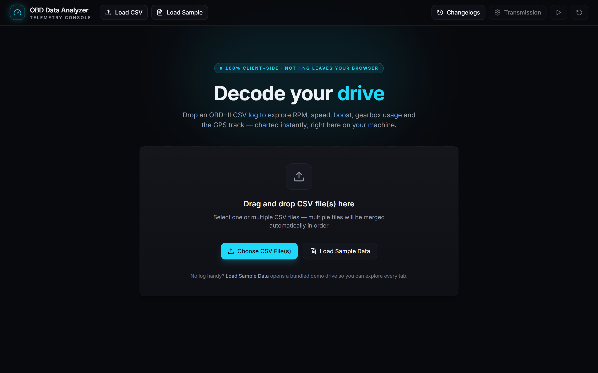
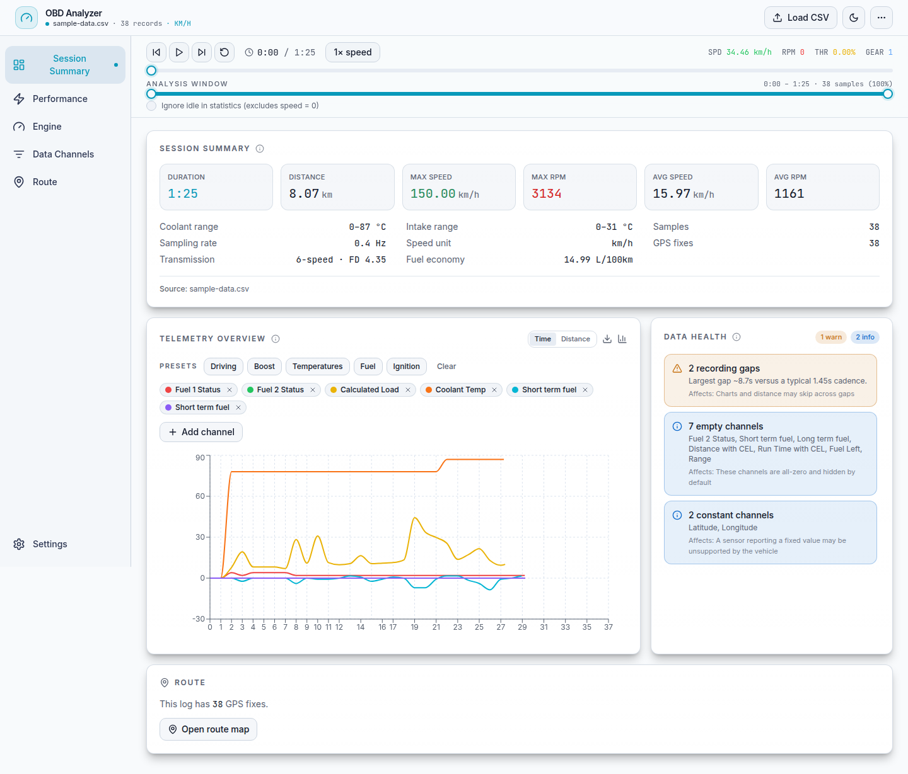
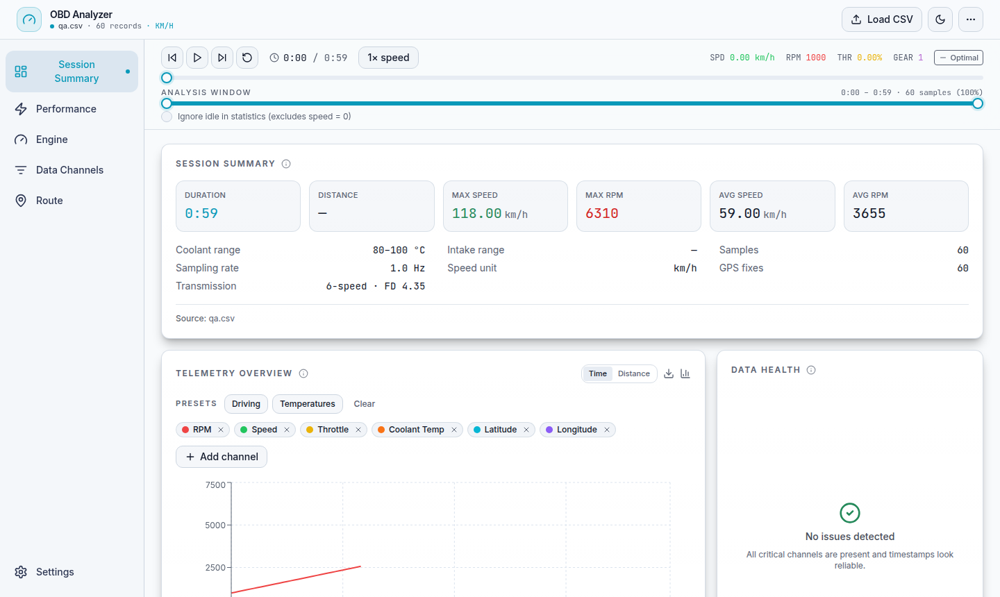
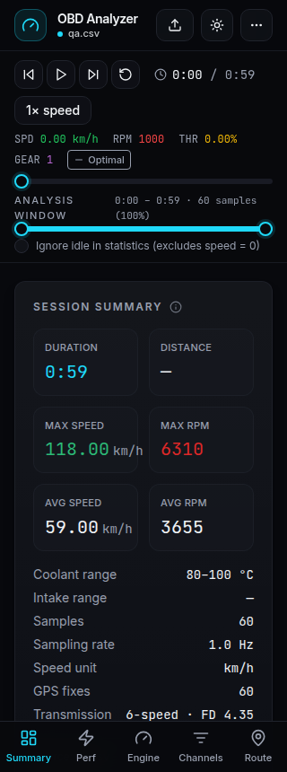

# OBD Analyzer

A fast, **fully client-side** dashboard for analyzing automotive telemetry logged from your car's OBD-II port. Drop in a CSV exported by an OBD-II scanner app and explore your drive across interactive charts and a GPS track map — no account, no server, no data ever leaves your browser.

> All parsing and rendering happens locally in the browser. There is **no backend, no database, and no telemetry** — host it as a static site or just run it locally. *(Two optional, off-by-default exceptions: the [share-link feature](#sharing-logs-optional) uploads a single log to the deployment's own backend when you click **Share**, and the GPS map's real basemaps fetch tiles from a public map provider when you switch off the default **Offline** style — see [GPS map basemaps](#gps-map-basemaps).)*

## Why I built this

I datalog every trip from my car's OBD-II port — but actually *reading* those logs was always the worst part. Any time I wanted to answer a simple question (what was boost doing on that pull? did the coolant temp creep up? where on the route did it stumble?) I was back to wrangling the raw CSV by hand — spreadsheets, manual filters, one-off queries — and none of it was something I could do quickly, let alone from my phone in a car park right after a drive.

**datalog.help** is the tool I wished I'd had: drop in the CSV and *see* the drive immediately — charts, session stats and the GPS track — with no setup and nothing to query. It's fully client-side, so it's just as quick on a phone as on a laptop, and I can check a log the moment I pull over instead of waiting until I'm back at a desk.

## Screenshots

The upload screen, and the analysis dashboard loaded with the bundled sample log:





The daylight theme, and the responsive mobile layout (bottom navigation, no wrapped tabs):





## Features

- **CSV upload** — single or multiple files (multi-file logs from the same session are merged in order), by drag-and-drop or file picker, with a clear explanation of merging vs. loading independent sessions.
- **Automatic column detection** — recognizes common OBD-II PID column names (Engine RPM, Vehicle speed, throttle position, coolant/intake temps, MAP/boost, MAF, lambda, GPS, altitude, etc.) and infers units, so exports from different apps "just work".
- **Post-import Session Summary & Data Health** — right after import you get a summary (duration, distance, max/avg speed & RPM, boost peak, temperature ranges, sample count & effective sampling rate, GPS coverage, detected units and transmission) plus a **Data Health** panel that flags missing critical/optional PIDs, unreliable or duplicate timestamps, recording gaps, empty/constant channels, outliers and GPS dropouts — each with the feature it affects and what to do about it.
- **Responsive dashboard shell** — a left navigation rail on desktop (collapses to icons) and a compact bottom navigation on mobile, so the primary sections never wrap into multiple rows of tabs.
- **Sticky playback bar with honest time** — shows **real elapsed time** (`M:SS`) when the log has trustworthy timestamps, and explicitly labels the position as a **sample index** when it doesn't — never calling a row number "time". Includes 0.5× / 1× / 2× / 4× speed, jump-to-ends and the existing keyboard shortcuts (Space, ← / →, Home / End).
- **Analysis sections:**
  - **Session Summary (Overview)** — the summary/health above, a focused telemetry chart with **channel presets, search-to-add and removable colour chips** (no permanently-tall checkbox panel), plotted against **time or distance travelled**, plus detected acceleration runs and a route preview.
  - **Performance** — grouped charts: RPM vs speed, throttle vs speed, power & torque, gearbox usage and gear distribution, each with a title, description and an empty state when the channel is absent.
  - **Engine** — temperatures, ignition advance, boost/MAP, fuel and throttle/brake.
  - **Data Channels** (formerly PID Analysis) — a searchable, category/status-filterable explorer table with per-channel min/max/current, a sparkline and a health status, pinning, and a multi-select synced **inspector** for comparing channels.
  - **Route** — a responsive, map-first workspace: a pannable, zoomable map of your route colored by speed, with start / finish / current markers and a collapsible **elevation profile**. Defaults to an **Offline** basemap (no network, now theme-aware); optionally switch to real **Satellite / Street / Terrain** tiles (see [GPS map basemaps](#gps-map-basemaps)).
- **Exports** — download the current time-range window as **CSV**, or the overview chart and the GPS map as **PNG**.
- **Light & dark themes** — a dark "instrument cluster" default and a daylight theme built entirely on semantic design tokens (status, chart grid/axis/tooltip, sidebar, telemetry series), so both themes are consistent with no hardcoded-theme failures; follows your system preference and remembers your choice.
- **Installable, offline-capable PWA** — add it to your home screen and it keeps working with no connection once loaded.
- **Gear estimation** — derives the engaged gear from speed + RPM using a configurable tyre size and gear ratios.
- **Robust number parsing** — handles `.` / `,` decimal separators (decided per file, so US thousands-grouped integers like `3,500` aren't misread as `3.5`), strips `#` comment lines, and tolerates exporter quirks such as backslash-escaped GPS decimals.
- **Off-main-thread parsing** — logs are parsed in a Web Worker, so importing a large file keeps the UI responsive.
- **Optional expiring share links** — a deployer can enable a Share button that creates a short, self-expiring link to a log. Off by default; opening a share link asks for confirmation before loading. See [Sharing logs](#sharing-logs-optional).

The UI is a dark/light "instrument cluster" theme built with Tailwind CSS and shadcn/ui, with tabular-figure readouts that stay stable as values change. It's keyboard-navigable with visible focus states, accessible names on icon-only controls, and respects `prefers-reduced-motion`.

## Supported input format

A standard wide OBD-II CSV export with a header row, e.g. from **Car Scanner**, **OBD Fusion**, **Torque**, or similar. The first column is a timestamp; remaining columns are PID readings named like `Engine RPM (RPM)`, `Vehicle speed (km/h)`, `Latitude (deg)`, `Longitude (deg)`, etc. Columns you don't have are simply skipped.

A demo log lives at [`public/sample-data.csv`](public/sample-data.csv) — load it from the upload screen to see the app in action.

## Getting started

```bash
pnpm install
pnpm dev
```

Open <http://localhost:3210> and upload a CSV (or the bundled sample). *(The dev/start port is set to **3210** in `package.json` — change it there if you prefer another.)*

### Production build

```bash
pnpm build && pnpm start
```

### Lint, type-check and tests

```bash
pnpm lint            # ESLint (next/core-web-vitals)
pnpm exec tsc --noEmit
pnpm test            # Vitest unit suite
pnpm build
pnpm test:e2e        # Playwright (runs against a production build)
```

The pure logic has a [Vitest](https://vitest.dev) suite (201 tests) covering number/CSV
parsing, acceleration-run detection, session summary, **sampling-rate math**, data health
(including a 200k-row stack-safety regression), **timestamp trust/quality analysis**,
**physically-correct distance integration** (with **trip-counter usability classification** so an
all-zero/constant/sparse counter can't override valid speed-time integration — and, when time is
untrusted, reports distance as unavailable rather than a false zero for a moving vehicle),
**baseline-aware cumulative Trip Fuel / Trip Duration** (excludes the initial baseline, treats drops
as re-baselines), **unit-safe fuel economy** (L/100km only from litres & km), **elapsed-time &
playback stepping**, x-domain-aware
LTTB downsampling, **idle-zone detection on the full pre-downsampled data**, the **hover→original-row
resolver** (mapping a sliced/downsampled point back to its raw row), chart x-axis selection, channel
stats/categories, multi-file merge (including quoted headers), **GPS numeric helpers** (km/h & mph,
unknown-speed handling, last-valid-fix marker policy, coverage, degenerate tracks), **transmission
validation & import parsing**, and **gear shift logic + indicator view**.

End-to-end tests use [Playwright](https://playwright.dev) across **desktop and mobile** viewports
(plus a dedicated **`share-enabled`** project that runs a real **production build** built with
`NEXT_PUBLIC_SHARING_ENABLED=true` in an isolated output directory): real file upload, malformed / header-only / partial logs,
sequential multi-file merge (continuous trusted timeline) and overlapping / incompatible-file
handling, **behavioural playback driven by a fake clock** (rate scaling incl. changing rate
mid-play, irregular sampling, duplicate timestamps, capped gaps, untrusted-cadence fallback,
pause/resume, seek-while-playing, arrow/shift-arrow/Home/End steps, custom-window end & rewind,
shortcuts ignored while typing in an input), chart axis labels, a **genuine rendered chart hover**
(a real pointer over the Recharts surface) proving the synchronized inspector resolves a
downsampled/sliced point back to the correct original row, the transmission draft
form (field-level validation, preset / import / auto-detect as draft-only) and its **close paths**
(X / backdrop / Cancel / Escape, focus-return and focus-trap), CSV & PNG export, the **mocked share
flow** (payload, link, expiry, copy, failure) **and shared-link loading** (success, expired, corrupt,
no accidental upload) plus the disabled state, GPS numeric readouts in km/h and mph, keyboard
shortcuts, the semantic shift indicator, collapsed-nav accessible names, a 20k-row render smoke test,
and **CI-enforced no-horizontal-overflow checks** — the main sections and the transmission dialog's
clean/dirty/invalid/reset/discard states — across 320–1440 px in both themes. The share UI is gated
solely by the build-time `NEXT_PUBLIC_SHARING_ENABLED` flag (no client-side override). CI
(`.github/workflows/ci.yml`) runs lint, type-check, unit tests, the production build and the
Playwright suite on every push and PR.

## Sharing logs (optional)

By default the app is 100% client-side and nothing you load ever leaves your browser. You can *optionally* enable a **Share** button that creates a short link to a log which **expires automatically**.

When a deployment has this turned on, clicking **Share** uploads the current log to *that deployment's own backend* and returns a link like `https://your-host/?share=ab12CD…`. Anyone with the link sees the same dashboard until it expires (24h by default). This is the only time a log leaves the browser, and only on an explicit click.

**How it works**

- A Next.js route handler (`app/api/share`) stores the gzipped CSV in a Supabase table with an `expires_at`. Reads filter on it, so an expired link returns `404` immediately — even before cleanup deletes the row.
- The browser only ever calls `/api/share`; it never talks to Supabase and never sees any Supabase key. The **service-role** key lives only in server-side environment variables.
- Share ids are 72-bit random (not enumerable), and oversized logs are rejected (2 MB of CSV by default).

**Enabling it**

1. Run [`scripts/share-schema.sql`](scripts/share-schema.sql) once against a Supabase project to create the `obd_shares` table.
2. Set the variables documented in [`.env.example`](.env.example): `NEXT_PUBLIC_SHARING_ENABLED=true`, `SUPABASE_URL`, `SUPABASE_SERVICE_ROLE_KEY` (and optionally `SHARE_TTL_HOURS` / `SHARE_MAX_BYTES`).
3. Deploy to a Node/serverless host (e.g. Vercel). With the variables unset, the Share button stays hidden and the app remains a pure static site.

> **Abuse controls.** The share endpoint applies a best-effort **per-IP rate limit** (10 requests/min), a **same-site origin check** (cross-site writes are rejected), and a minimal **CSV-shape check** on the payload. The rate limiter is in-memory and per-instance, so a serverless deployment with many instances should still put a shared limiter (e.g. Vercel/Upstash) in front for hard guarantees. The endpoint remains unauthenticated by design — don't enable sharing on an untrusted public deployment without additional controls.

## GPS map basemaps

The GPS Track tab defaults to an **Offline** basemap — a neutral backdrop drawn entirely in the browser, with **no network requests**. Switch to a real basemap with the **Satellite / Street / Terrain** buttons; the track is **pannable** (drag) and **zoomable** (scroll wheel, or the on-map `+ / − / fit` controls).

Choosing a real basemap fetches map tiles from a public, keyless provider, which sends the map viewport's coordinates to that provider (the same as any web map). The default **Offline** style never does this.

| Style | Provider | Attribution |
|-------|----------|-------------|
| Satellite | Esri World Imagery | Imagery © Esri |
| Street | [OpenStreetMap](https://www.openstreetmap.org/copyright) | © OpenStreetMap contributors |
| Terrain | [OpenTopoMap](https://opentopomap.org/) | © OpenTopoMap (CC-BY-SA) |

No API keys are required. These providers have fair-use tile policies suitable for personal / self-hosted use; for heavy or commercial use, point `MAP_TILE_SOURCES` in [`lib/mercator.ts`](lib/mercator.ts) at your own tile source.

## Tech stack

- [Next.js 14](https://nextjs.org) (App Router) + React 18
- TypeScript (strict — the build fails on type errors)
- [Recharts](https://recharts.org) for charts, HTML Canvas for the GPS map
- A **Web Worker** for off-main-thread CSV parsing, plus a service worker + manifest for the installable, offline PWA
- Tailwind CSS + [shadcn/ui](https://ui.shadcn.com) (Radix primitives), themed entirely through semantic CSS-variable design tokens
- [Vitest](https://vitest.dev) for unit tests and [Playwright](https://playwright.dev) for end-to-end tests
- [Supabase](https://supabase.com) — *optional*, used only by the share feature

## Project layout

```
app/page.tsx                       # thin composition layer — renders <Dashboard/>
app/layout.tsx                     # fonts, metadata, no-flash theme bootstrap, PWA registration
app/manifest.ts                    # web app manifest (installable PWA)
app/globals.css                    # semantic design tokens / light + dark instrument-cluster theme
app/changelogs/                    # changelog page
app/api/share/                     # optional share feature: server route handlers (create + fetch)
hooks/use-obd-session.ts           # all session state, playback, imports & derived telemetry
components/dashboard/              # feature components composed by <Dashboard/>
  dashboard.tsx                      #   orchestration: shell + active section + dialogs
  app-header.tsx side-nav.tsx bottom-nav.tsx   #   responsive shell + navigation
  playback-bar.tsx                   #   sticky playback / time-range surface
  session-summary.tsx data-health-panel.tsx    #   post-import comprehension step
  overview-tab.tsx overview-chart.tsx channel-picker.tsx
  channels-explorer.tsx gps-workspace.tsx
  transmission-dialog.tsx missing-pids-dialog.tsx share-dialogs.tsx
  upload-screen.tsx toast.tsx nav-config.ts
components/telemetry/             # reusable primitives (section header, stat card, sparkline, empty state)
components/gps-track-map.tsx        # the GPS canvas map (pan / zoom / tiles / speed-colored, theme-aware)
components/performance-charts.tsx   # Performance chart grid (memoized, lazy-loaded)
components/engine-charts.tsx        # Engine chart grid (memoized, lazy-loaded)
components/pwa-register.tsx         # service-worker registration
components/ui/                      # shadcn/ui primitives
lib/parse-csv.ts                    # pure CSV parser (text → typed result)
lib/parse-csv.worker.ts             # runs the parser in a Web Worker
lib/parse-worker.ts merge-csv.ts    # worker wrapper + multi-file merge          (merge + .test.ts)
lib/session-summary.ts data-health.ts elapsed-time.ts   # post-import derivations (+ .test.ts each)
lib/channel-stats.ts channel-categories.ts chart-theme.ts   # channel table + theming (+ .test.ts)
lib/parse-number.ts accel-runs.ts   # separator-aware parsing / accel detection  (+ .test.ts)
lib/gear.ts                        # gear estimation + shift logic
lib/transmission.ts transmission-presets.ts  # config import/export + vehicle presets
lib/mercator.ts                    # Web-Mercator projection + map tile sources
lib/chart-export.ts                # chart → PNG export
lib/csv.ts lib/format.ts lib/stats.ts lib/downsample.ts lib/tire.ts …  # focused helpers
lib/share.ts                       # server-only share helpers (gzip, Supabase config)
types/obd.ts                       # shared domain types
e2e/                               # Playwright end-to-end tests + screenshot helper
public/sw.js                       # service worker (offline caching)
public/sample-data.csv             # demo telemetry log
scripts/share-schema.sql           # Supabase table for the optional share feature
.env.example                       # config for the optional share feature
docs/                              # README screenshots
```

The pure logic — CSV parsing, gear math, map projection, acceleration detection, session summary, data health, exports — lives in small, unit-tested `lib/` modules. All session state and derived telemetry live in the `useObdSession` hook, and the UI is assembled from focused `components/dashboard/` feature components; `app/page.tsx` is just a composition layer. High-frequency playback state is kept isolated so the memoized chart subtrees don't re-render every frame. The heavy chart sections and the GPS map are code-split so they load on demand.

## License

[MIT](LICENSE) © Jozkah
